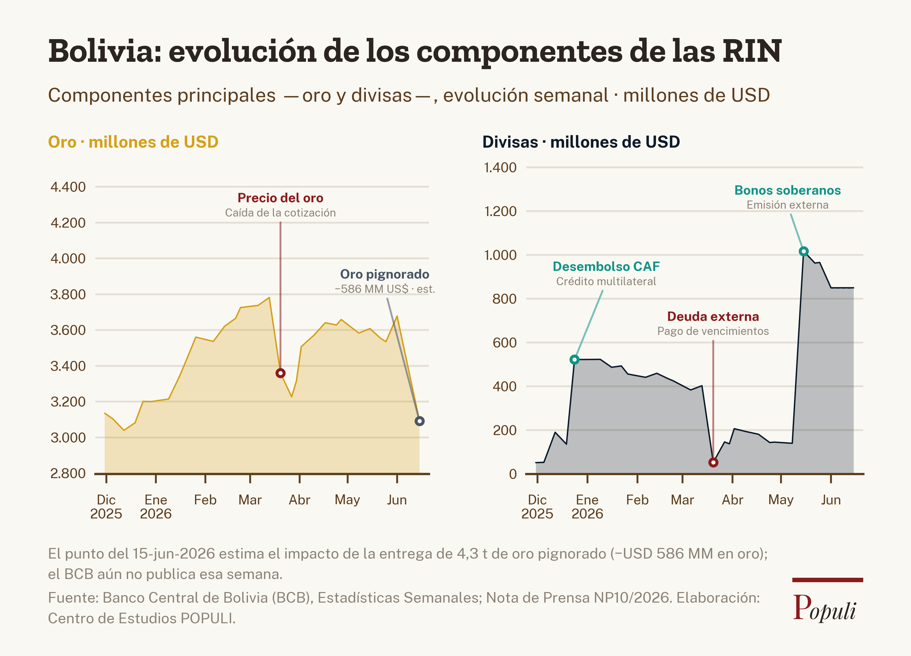

# Receta: `series-eventos` — serie temporal anotada con hitos

> **Estilo:** figura de publicación editorial (tipo FMI / *Finance & Development*)
> de series temporales económicas, donde el relato son los **eventos**: cada hito
> se marca con un **punto sobre la línea + guía fina + etiqueta de dos líneas**
> (nombre en negrita + detalle gris), en color semántico (verde = ingreso,
> rojo = caída, gris = estimado).
>
> **Caso de referencia:** Reservas Internacionales del BCB y el oro pignorado.



Usa esta receta cuando quieras contar **qué movió una serie y cuándo** (reservas,
tipo de cambio, inflación semanal, deuda…), no solo mostrar su nivel.

---

## Anatomía de la figura

```
┌─────────────────────────────────────────────────────────────┐
│  Título (Zilla Slab) + subrayado rojo                        │  ← ps.componer()
│  Subtítulo                                                    │
│  Oro · millones de USD (negrita)   Divisas · millones de USD │  ← rótulo por panel
│ ┌───────────────────────────┐   ┌──────────────────────────┐│
│ │  PANEL ORO (escala propia)│   │ PANEL DIVISAS (escala 2) ││  ← 2 paneles LADO A LADO
│ │   ·línea fina + área      │   │   ·línea fina + área     ││
│ │   ·punto+guía+etiqueta    │   │   ·punto+guía+etiqueta   ││
│ └───────────────────────────┘   └──────────────────────────┘│
│  Nota metodológica + Fuente + wordmark Populi                │  ← ps.componer()
└─────────────────────────────────────────────────────────────┘
```

Decisiones de diseño que definen el estilo (resultado de la sesión 2026-06-18):

1. **El evento es el protagonista.** Punto hueco del color del evento sobre la
   línea + guía vertical fina hasta una etiqueta de **dos líneas centradas entre
   sí** (nombre en negrita real · detalle gris explicativo). Sin banda sombreada:
   el punto ya fija el hito.
2. **Dos componentes, lado a lado, cada uno en su escala.** Un movimiento chico
   en divisas se ve aunque sea invisible dentro del total. Encuadre compartido:
   números, rótulos y título alineados al mismo margen; paneles del mismo ancho.
3. **El punto estimado se distingue siempre:** tramo en línea punteada + punto
   hueco gris pizarra. Nunca se disfraza de dato observado.
4. **Formato `informe_horizontal` (~3:2).** Más editorial que el cuadrado; el pie
   ocupa pocas líneas. Fuentes fijadas con `SC_REF` (no crecen al ensanchar).

---

## De dónde sale cada cosa

| Pieza | Archivo | Responsable de… |
|---|---|---|
| Marca, paleta, fuentes, marco, wordmark, formatos, `guardar()` | `viz/populi_style.py` | identidad POPULI (no se toca por gráfico) |
| Eje de fechas (ticks mensuales ES) + anotación de eventos (punto+guía+etiqueta) | `viz/charts/series_eventos.py` | **el estilo reutilizable** |
| Datos, composición de paneles, layout de cada callout | `figura.py` (esta carpeta) | **lo propio de este gráfico** |

> Para un gráfico nuevo de este estilo, **`series_eventos.py` no se toca**;
> copias `figura.py`, cambias datos y reajustas `LAYOUT` / `ABBR` / `DET`.

### API de `series_eventos.py`

```python
import series_eventos as se

se.estilo_eje(ax, dates, sc)                 # look editorial + eje de fechas ES
se.marcar_eventos(ax, EVENTS, x=x, fechas=fechas, panel="oro",
                  ymin=lo, ymax=top, sc=sc, serie_y=serie,   # ancla el punto al dato
                  layout=LAYOUT, abbr=ABBR, detalle=DET,
                  banda_alpha=0.0)            # 0 = sin banda (solo punto + guía)
se.colores_evento()                          # {"up","down","est"} de la paleta
se.BOLD                                       # familia Public Sans Bold (negrita REAL)
```

> **Negrita real:** `ps.fp("Public Sans", …, weight="bold")` **NO** funciona —
> al cargar la fuente por archivo, matplotlib ignora `weight`. Usa `se.BOLD`
> (familia `Public Sans Bold` → `PublicSans-Bold.ttf`).

---

## Contrato de datos

**Serie** (`data/serie_final.json` → `["serie"]`): lista de puntos ordenados por fecha.

```jsonc
{ "date": "2026-06-01", "oro": 2730, "divisas": 1190, "deg": 70, "fmi": 40,
  "rin": 4030, "tipo": "real" }      // tipo: "real" | "estimado"
```
`figura.py` toma el primer punto con `tipo:"estimado"` como inicio del tramo
proyectado (línea punteada + punto hueco gris).

**Eventos** (`data/events.json`): lista de hitos.

```jsonc
{ "date": "2026-03-20",            // debe existir EXACTO en la serie
  "dir": "down",                   // "up" (verde) | "down" (rojo)
  "short": "Deuda externa + precio oro",
  "panels": ["oro", "divisas"],    // en qué paneles aparece
  "estimated": false }             // true → color gris, manda sobre dir
```

El **layout de cada callout** NO está en los datos: vive en `figura.py`, indexado
por `(panel, date)`:
- `ABBR` → nombre (1ª línea, negrita).
- `DET`  → detalle (2ª línea, gris): la "información extra" de cada llamada.
- `LAYOUT` → `ly` (altura 0-1 de la base del bloque) · `dx` (corrimiento
  horizontal del bloque centrado, fracción del rango X; <0 = izquierda).

> **Tip:** para clavar una etiqueta en una banda de valores concreta, convierte el
> valor a `ly`: `ly = (valor − lo) / (top − lo)`, con el `lo`/`top` del panel.

---

## Cómo hacer un gráfico nuevo en este estilo

1. **Copia la carpeta:** `viz/recetas/series-eventos/` → `viz/recetas/<tu-grafico>/`.
2. **Reemplaza los datos** en `data/` respetando el contrato de arriba.
3. **Ajusta la composición** en `figura.py`: para 1 sola serie, deja un panel a
   todo el ancho; para 2, lado a lado (como aquí).
4. **Marca los eventos:** escribe `events.json` y afina `ABBR`/`DET`/`LAYOUT`.
   Iterativo: `python figura.py`, miras el PNG, reajustas `ly`/`dx`. **Es la parte
   que toma tiempo.**
5. **Render:** `python figura.py` → `output/<slug>.png`.
6. *(Opcional)* **Publicar al Banco:** usa `componer()` directo (no `publicar()`),
   así que para que salga en la galería Astro hay que copiar el PNG a
   `public/graficas/` y registrar su ficha — ver `viz/README.md`.

### Ejecutar

```bash
cd galeria-populi/viz/recetas/series-eventos
python figura.py            # → output/reservas_oro_pignorado.png
```

Requisitos: `pip install matplotlib numpy` (fuentes ya empaquetadas en `viz`).

---

## Datos de origen (`pipeline/`)

Cómo se construyó `serie_final.json` desde la fuente cruda del BCB. **No es parte
del estilo** (es adquisición de datos), se guarda para reproducibilidad:

- `extract_semanal.py` — lee los Excel semanales del BCB (`raw/`, no versionados).
- `build_dataset.py` — arma la serie + ancla mensual + el punto estimado.
- `explorador.html` — vista rápida para revisar la serie antes de publicar.

---

## Aportes al motor (reutilizables por toda la Galería)

Esta receta dejó tres piezas en `viz/` que sirven para cualquier gráfico:

- **Formato `informe_horizontal`** (~3:2) en `populi_style.py`, con `SC_REF` para
  que las fuentes no crezcan al ensanchar (misma técnica que los mapas mundiales).
- **`series_eventos.marcar_eventos`** — callouts profesionales (punto + guía +
  etiqueta de 2 líneas) reutilizables.
- **`series_eventos.BOLD`** — la forma correcta de pedir negrita real con
  Public Sans (ver nota arriba).

## Notas

- Paleta: **oro `#D4A017`** (Oro) + **navy `#0D1B2A`** (Divisas, 2ª serie oficial).
  Si se prefiere más vivo, existe `serie_azul #2563EB` (sub-paleta "chart colors").
- Los `raw/*.xlsx` del BCB (~18 MB) **no se copiaron** aquí; siguen en el repo
  original `pub-reservas-oro` si hay que regenerar la serie.
- El repo original `pub-reservas-oro` quedó **intacto** como respaldo.
